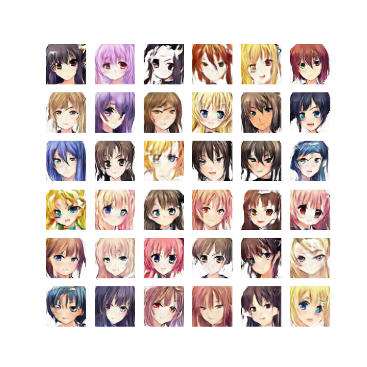
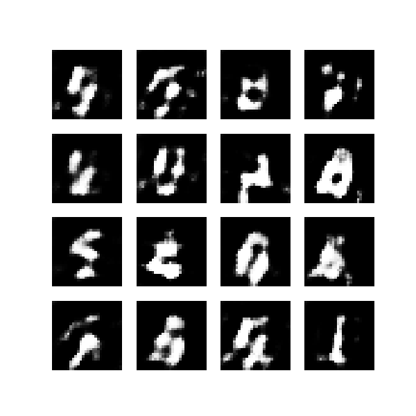

# DCGAN-anime-faces
For this project, I use DCGAN for generating anime faces, trained on the anime faces dataset https://www.kaggle.com/datasets/splcher/animefacedataset. 

I also test out the DCGAN architecture for generating handwritten digits based on the MNIST dataset. 

## DCGAN architecture
Model architecture used in the DCGAN paper https://arxiv.org/pdf/1511.06434.pdf: 

## Loss function for GAN
The loss function for GAN, also known as the min-max loss:  
$E_x[log(D(x))] + E_z[log(1 - D(G(z)))]$

The generator $G$ will try to minimize loss function, and the discriminator $D$ tries to maximize this function. 

The generator learns to approximate the distribution of the actual training data, and then it samples from this learned distribution. While training, the generator and discriminator will both train alternatively while keeping the other one fixed.

The generator takes in a random normal distribution ($z$), and outputs a generated sample close to the training data distribution. 

The discriminator tries to evaluate the output generated by the generator and outputs a value between 0 and 1. If the value is close to 0, it predicts the generated samples as fake, and if the value is close to 1, then the generated sample is predicted as real.

#### Discriminator Loss
The discriminator essentially is a classifier that performs binary classification, and the loss function is the binary cross entropy loss.

$L(\hat{y}, y) = y ⋅ log(\hat{y}) + (1 - y) ⋅ log(1 - \hat{y})$

Where, $\hat{y}$ is the prediction, and $y$ is the ground truth. The discriminator tries to maximize this loss function.

When the label is 1, the input is x from the training data, and the loss function becomes:  
$1 ⋅ log(D(x)) + (1 - 1) ⋅ log (1 - D(x)) = log(D(x))$

When the label is 0, the input is G(z) from the generated sample, and the loss function becomes:
$0 ⋅ log(D(G(z)) + (1 - 0) ⋅ log(1 - D(G(z))) = log(1 - D(G(z)))$

#### Generator Loss  
The generator will try to fool the discriminator to classify its output as real. The loss function for the generator is thus:

$log(1 - D(G(z)))$

The generator will try to minimize this function.

## Results
#### Anime Faces

#### MNIST digits

